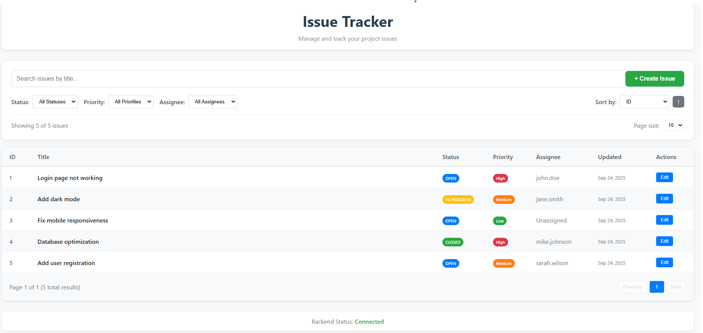

# Issue Tracker

A full-stack issue tracking application built as part of a hiring assignment.

## 🚀 Tech Stack

- **Backend**: Python Flask with REST APIs
- **Frontend**: Angular with TypeScript
- **Database**: In-memory storage (for demo purposes)

## ✨ Features

- ✅ View issues in a professional table interface
- ✅ Search issues by title
- ✅ Filter by status, priority, and assignee  
- ✅ Sort by any column (ascending/descending)
- ✅ Pagination with configurable page size
- ✅ Create new issues with validation
- ✅ Edit existing issues
- ✅ View detailed issue information
- ✅ RESTful API with full CRUD operations

## 📡 API Endpoints

- `GET /health` - Health check
- `GET /issues` - Get all issues (supports search, filters, sorting, pagination)
- `GET /issues/:id` - Get single issue
- `POST /issues` - Create new issue
- `PUT /issues/:id` - Update existing issue

## 🛠️ Setup Instructions

### Backend Setup

```bash
cd backend
python -m venv venv
venv\Scripts\activate  # Windows
# source venv/bin/activate  # macOS/Linux
pip install -r requirements.txt
python app.py
```

**Backend will run on**: http://localhost:5000

### Frontend Setup

```bash
cd frontend
npm install
ng serve
```

**Frontend will run on**: http://localhost:4200

## 🎯 Usage

1. Start the Python backend server
2. Start the Angular frontend server  
3. Open http://localhost:4200 in your browser
4. Use the interface to manage issues

## 📋 Assignment Requirements Met

✅ Python backend with REST APIs  
✅ Angular frontend with functional UI  
✅ Issues list with table display  
✅ Search, filter, sort functionality  
✅ Pagination support  
✅ Create and edit issue forms  
✅ Issue detail view  
✅ Professional UI/UX design  

## 📸 Screenshots


*Professional issue tracking interface with search, filters, and CRUD operations*

## 🗂️ Project Structure

```
issue-tracker/
├── backend/
│   ├── app.py
│   ├── requirements.txt
│   └── venv/
├── frontend/
│   ├── src/
│   ├── angular.json
│   ├── package.json
│   └── node_modules/
├── README.md
├── .gitignore
└── screenshot.png
```

## 🚦 Getting Started

1. **Clone the repository**
   ```bash
   git clone https://github.com/Farveen826/issue-tracker.git
   cd issue-tracker
   ```

2. **Set up the backend**
   ```bash
   cd backend
   python -m venv venv
   venv\Scripts\activate
   pip install -r requirements.txt
   python app.py
   ```

3. **Set up the frontend** (in a new terminal)
   ```bash
   cd frontend
   npm install
   ng serve
   ```

4. **Access the application**
   - Frontend: http://localhost:4200
   - Backend API: http://localhost:5000

## 🧪 Testing the API

You can test the API endpoints using tools like Postman or curl:

```bash
# Health check
curl http://localhost:5000/health

# Get all issues
curl http://localhost:5000/issues

# Get specific issue
curl http://localhost:5000/issues/1

# Create new issue
curl -X POST http://localhost:5000/issues \
  -H "Content-Type: application/json" \
  -d '{"title":"Test Issue","description":"Test description","status":"Open","priority":"Medium","assignee":"John Doe"}'
```

## 🔧 Configuration

The application uses default configurations suitable for development:

- **Backend Port**: 5000
- **Frontend Port**: 4200
- **CORS**: Enabled for development
- **Database**: In-memory storage (resets on restart)

## 🤝 Contributing

This is a demo project for a hiring assignment. For production use, consider:

- Adding persistent database (PostgreSQL, MongoDB)
- Implementing user authentication
- Adding comprehensive error handling
- Writing unit and integration tests
- Adding Docker containerization

## 📝 License

This project is created for demonstration purposes as part of a hiring process.

---

**Developed by**: Farveen  
**Contact**: [farveenfathima391@gmail.com]  
**GitHub**: [@Farveen826](https://github.com/Farveen826)